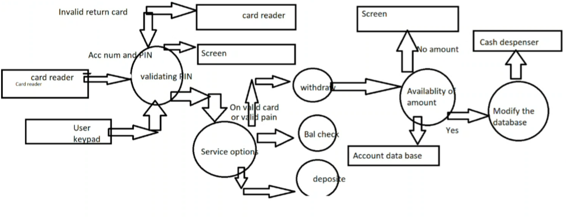

# MODULE 3: WORKING WITH SQL & SQLITE
# Data Design Notes

## Data
Data: in simple words data can be facts related to any entity.  
Example: name, age, address, phone number etc.

## Database
A database is a structured collection of data that is stored and managed electronically.  
It allows for efficient storage, retrieval, and manipulation of data.  
Example: SQL databases like MySQL, PostgreSQL, SQLite etc.

## DBMS
A Database Management System (DBMS) is software that enables users to create, manage, and interact with databases.  
It provides tools and functionalities for data storage, retrieval, and manipulation.  
For example: online telephone directory, electricity service provider, Facebook.

## Transactions
Transactions - group a set of tasks into a single execution unit.  
There are 4 properties of a database system (ACID):

### 1. Atomicity (all or none)
Either all tasks are executed or none.  

An atomic transaction is an indivisible and irreducible series of database operations that either all occur, or nothing occurs. It is the way to ensure data integrity.

### 2. Consistency (valid data)
Ensures data integrity and accuracy. 

Consistency in database systems refers to the requirement that any given database transaction must change affect data only in allowed ways. The database ensures that intermediate, inconsistent states are not visible to users.

### 3. Isolation (independent execution)
Concurrent transactions do not interfere with each other.  

Isolation is typically defined at database level as a property that defines how/when the changes made by one operation should not affect the other data.

### 4. Durability (permanent changes)
Once a transaction is committed, changes are permanent.  

Once a transaction has been committed (finalised), the changes are permanent, even if there is a system crash. The database ensures that the data is safely stored and can be recovered.

Where the data is to be structured and ordered and to be in a table format, we can use SQL.

## SQL
Structured Query Language (SQL) is a standard programming language specifically designed for managing and manipulating relational databases.  

It provides a set of commands and syntax to perform various operations on databases, such as querying data, inserting records, updating records, deleting records, creating and modifying database structures, and managing access to the data.

# Topic 1: schema and subschema

## What is a schema?
What table exists, what are the columns in the table, what are the data types of each column, what are the relationships between tables.  

A schema does not store any values, it only define the structure of the database.

## Components of a schema

### Table names
students, courses, enrolments

### Column names
student_id, student_name, course_id, course_name, enrolment_date

### Data types
int, varchar, date, bigint, smallint, tinyint  
- int: integer values  
- varchar: variable-length character strings  
- date: date values  
- bigint: large integer values  
- smallint: smaller integer values  
- tinyint: very small integer values  

### Constraints
primary key, foreign key, unique, not null, check  
- Primary key: uniquely identifies each record in a table  
- Foreign key: establishes a relationship between two tables (references primary key in another table)  
- Unique: ensures that all values in a column are unique  
- Not null: ensures that a column cannot have null values  
- Check: ensures that values in a column meet a specific condition  

## Subschema
A subschema is a subset of the schema that defines a specific view or perspective of the database.  

It allows users to focus on specific parts of the database relevant to their needs. For example, a subschema for students may only include the student_id and student_name columns while excluding other columns like enrolment_date or course details.

### Why are subschemas used?
1. Security: restrict access to sensitive data  
2. Simplification: provide a simplified view of the database for specific users  
3. Role-based access: different users may have different subschemas based on their roles  
4. Performance: reduce the amount of data retrieved for specific queries  

## Example of a student subschema will include

### Their personal details
student_id, student_name, date_of_birth  

### Enrolled course
course_id, course_name  

### Grades
course_id, grade  

### What they cannot access
- Other student data  
- Faculty data  
- Administrative data  

# DB (Database) Library
For this, we need: Books, Members, Loans tables. These are called entities.

### Attributes of each entity (PK - Primary Key, FK - Foreign Key)
**Books:** book_id (PK), title, author, publisher, year_published, amount_available  
**Members:** member_id (PK), name, address, phone_number, email, deposit_amount  
**Payments:** payment_id (PK), member_id (FK), amount, payment_date  
**Loans:** loan_id (PK), book_id (FK), member_id (FK), issue_date, return_date, due_date  

# TOPIC 2: Data Normalisation upto TNF (Third Normal Form)
Data Normalisation is the process of organizing data in a database to reduce redundancy and improve data integrity.  

It involves breaking down a large table into smaller, related tables and establishing relationships between them.  

There are several normal forms (NFs) that define the level of normalisation:

## 1. First Normal Form (1NF)
Ensures that each column contains atomic (indivisible) values and each row/record is unique. No repeating groups or arrays are allowed.

### Example table not in 1NF
| Student_ID | Name  | Phone_Numbers   |
|------------|-------|-----------------|
| 1          | Alice | 123-456, 789-012|
| 2          | Bob   | 345-678         |

### To convert to 1NF
| Student_ID | Name  | Phone_Number |
|------------|-------|--------------|
| 1          | Alice | 123-456      |
| 1          | Alice | 789-012      |
| 2          | Bob   | 345-678      |

Here, each phone number is stored in a separate row, ensuring atomicity.

## 2. Second Normal Form (2NF)
Achieved when a table is in 1NF and all non-key columns are fully dependent on the primary key. No partial dependencies are allowed. A partial dependency occurs when a non-key column is dependent on only a part of a composite primary key.

### Example table not in 2NF
| Student_ID | Course_ID | Student_Name | Course_Name |
|------------|-----------|--------------|-------------|
| 1          | 101       | Alice        | Math        |
| 1          | 102       | Alice        | Science     |
| 2          | 101       | Bob          | Math        |

### To convert to 2NF
**Students Table**
| Student_ID | Student_Name |
|------------|--------------|
| 1          | Alice        |
| 2          | Bob          |

**Courses Table**
| Course_ID | Course_Name |
|-----------|-------------|
| 101       | Math        |
| 102       | Science     |

**Enrollments Table**
| Student_ID | Course_ID |
|-----------|-----------|
| 1         | 101       |
| 1         | 102       |
| 2         | 101       |

Here, non-key columns are fully dependent on the primary key.

## 3. Third Normal Form (3NF)
Achieved when a table is in 2NF and all non-key columns are not dependent on other non-key columns. No transitive dependencies are allowed. A transitive dependency occurs when a non-key column depends on another non-key column.

### Example table not in 3NF
| Student_ID | Student_Name | Tutor_Name |
|------------|--------------|------------|
| 1          | Alice        | Dr. Smith  |
| 2          | Bob          | Dr. Jones  |

### To convert to 3NF
**Students Table**
| Student_ID | Student_Name | Tutor_ID |
|------------|--------------|----------|
| 1          | Alice        | 1        |
| 2          | Bob          | 2        |

**Tutors Table**
| Tutor_ID | Tutor_Name |
|----------|------------|
| 1        | Dr. Smith  |
| 2        | Dr. Jones  |

Here, non-key columns do not depend on other non-key columns. If the tutor of a student changes, we only need to update the Tutors table, ensuring data integrity and reducing redundancy.

There are higher normal forms like BCNF (Boyce-Codd Normal Form), 4NF, 5NF, but they are less commonly used.

# Topic 3: Wiring Data Flow in a System
Wiring data flow in a system involves designing how data moves through different components of a system, from input to processing to output. It includes defining data sources, data transformations, and data destinations. The primary tool for this is the Data Flow Diagram (DFD). It visually represents the flow of data within a system, showing how data is processed and where it is stored. The Data Flow Diagram is used to understand how data moves through an information system. This logic flow helps in designing a physical database. It shows:
- Where the data comes from
- How the data processed
- Where the data is stored
- Where the data goes
It explains the movement of data, not the tables themselves.

## DFD Symbols

### 1. Process
Represents a function or operation that transforms data. Takes data as input, processes it, and produces output.  
Looks like: `O` or `⬭`  
Example: "Process Payment", "Validate User Login"

### 2. Data Flow
Represents movement of data between processes, data stores, and external entities.  
Looks like: `➔`  
Example: "User Details", "Payment Information"

### 3. Data Store
Repository where data is stored.  
Looks like: `⧉` or `||`  
Example: "Customer Database", "Order Records", "Product Inventory"

### 4. External Entity
Outside system or user interacting with the system.  
Looks like: `▭`  
Example: "Customer", "Supplier", "Bank System"

## DFD Levels

### 1. Context Level DFD (Level 0)
High-level overview showing system as a single process.

### 2. Level 1 DFD
Breaks down the main process into sub-processes. This is called **decomposition**.

### 3. Level 2+ DFD
Further decomposition into more detailed processes.

DFDs are useful for understanding system requirements, identifying bottlenecks, and designing efficient data processing workflows.

## Deconstructing a DFD

Example: Level-1 Data Flow Diagram for an ATM System

